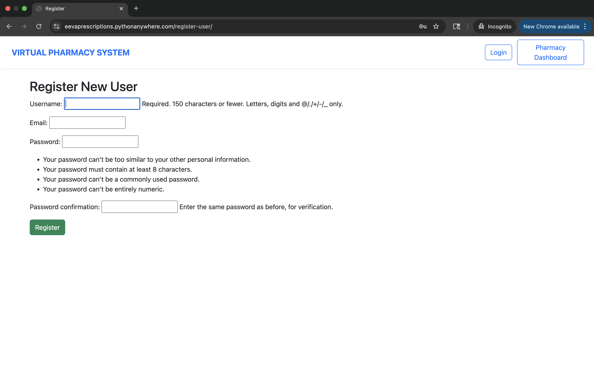
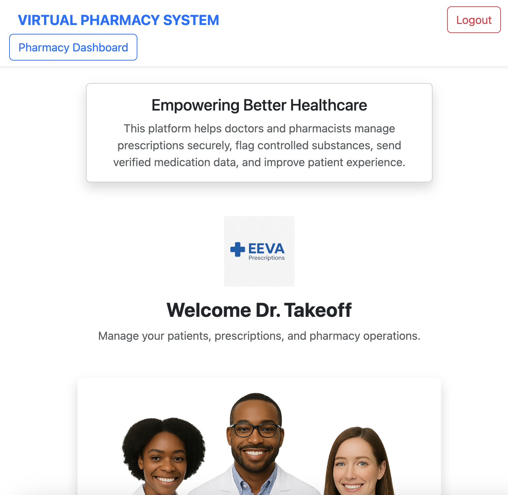
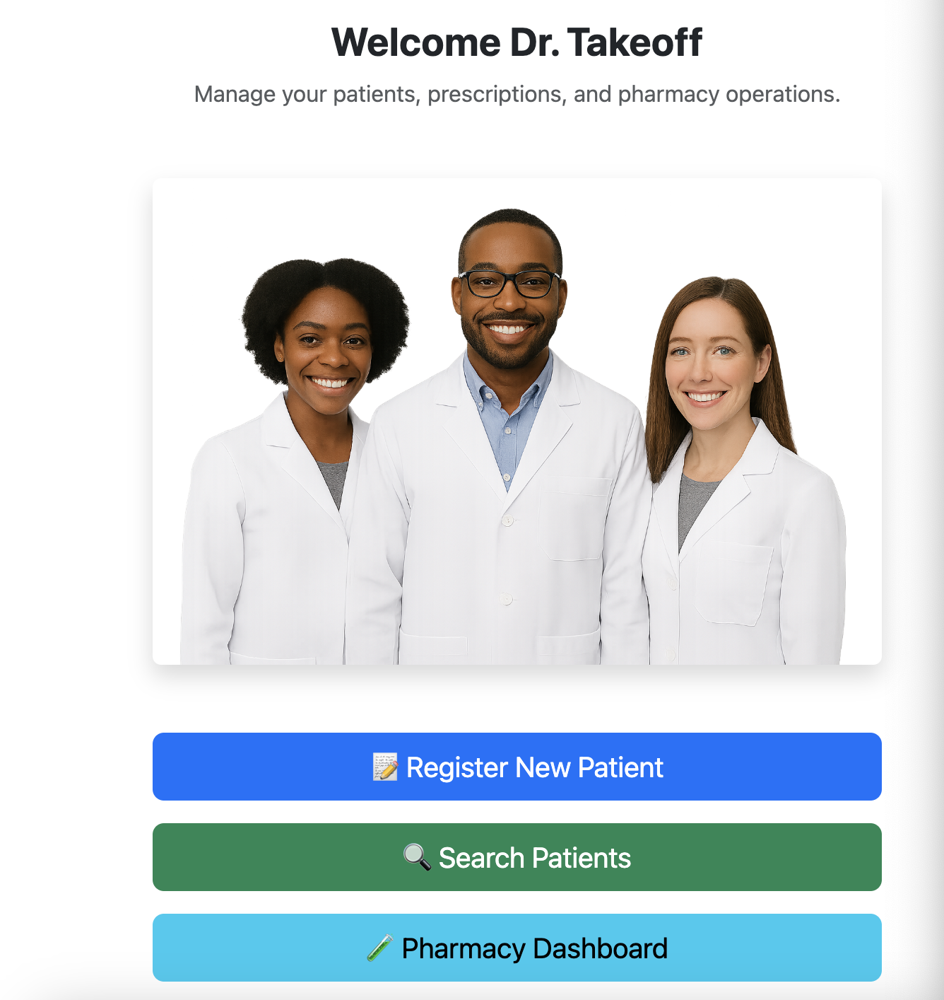
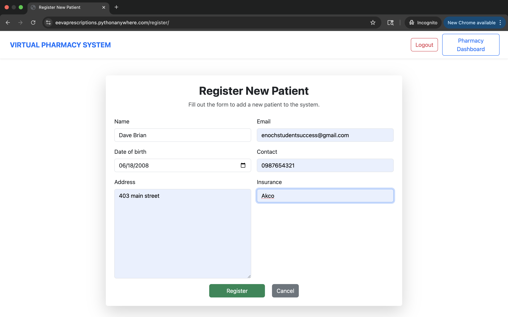

#  CS-PHARMACY: Virtual Hospital Prescription System

A Django-based web application that allows doctors to manage patients, handle prescriptions, check for **controlled substances**, substitute medication when necessary, and **send prescriptions to a pharmacy** for verification. The system also sends email confirmations and assists pharmacists verify medications in a secure, centralized dashboard.

---
## Live Deployed Web app link
[https://eevaprescriptions.pythonanywhere.com](https://eevaprescriptions.pythonanywhere.com/)
---
**Steps to access**
- Create an account with a valid email.
- Login using that email

##  How to Run the App locally

1. **Clone the repository**:
   ```bash
   git clone https://github.com/Enochteo/CS-PROJECT.git
   cd CS-PROJECT
   ```

2. **Set up a virtual environment**:
   ```bash
   python3 -m venv venv
   source venv/bin/activate
   ```

3. **Install requirements**:
   ```bash
   pip install -r requirements.txt
   ```

4. **Run migrations**:
   ```bash
   python manage.py makemigrations
   python manage.py migrate
   ```

5. **Create a superuser (for admin access)**:
   ```bash
   python manage.py createsuperuser
   ```

6. **Run the server**:
   ```bash
   python manage.py runserver
   ```

7. **Login at**:  
   /login (route for as a doctor)

---

##  Project Workflow

### 1. Register Patients
- Doctors can register a new patient using the **"Register New Patient"** form.
- Each patient has their name, DOB, contact info, insurance, and email.

###  2. Search & View Patients
- Use the **Search Patients** page to retrieve a list of registered patients.
- Click on a patient to view all prescriptions.

### 3. Add a Prescription
- When adding a new prescription:
  - The system **checks if the drug is controlled**.
  - If so, it substitutes it automatically and **notifies the doctor** via a message.
  - It then calculates the **price** based on the updated drug.

###  4. Send Prescription to Pharmacy
- Each prescription can be **sent to a pharmacy** for verification.
- Sent prescriptions are marked as:
  -  Sent
  -  Pending or  Verified (depending on pharmacy response)

###  5. Pharmacy Dashboard
- Pharmacists can log in and access the **Pharmacy Dashboard** to:
  - View all sent prescriptions
  - Verify a prescription
  - Confirm substitutions and controlled drug handling

### 6. Email Integration
- Upon pharmacy verification, the patient receives a **confirmation email** with prescription details.

---
---
## Screenshots
Login Page:

New-User registration page:

Landing page:


Registering a new patient:

---

##  Project Structure
```
CS-PHARMACY/
├── core/                         # Main Django app
│   ├── admin.py                 # Admin configuration
│   ├── apps.py                  # App configuration
│   ├── forms.py                 # Django forms for patients and prescriptions
│   ├── models.py                # Database models
│   ├── urls.py                  # App-specific routes
│   ├── utils.py                 # Utility functions (e.g., substitution, pricing)
│   ├── views.py                 # Application views
│   ├── templatetags/
│   │   └── form_filters.py      # Custom template filters
│   ├── migrations/              # Database migrations
│   └── templates/
│       └── core/                # HTML templates for UI
│           ├── base.html
│           ├── home.html
│           ├── register.html
│           ├── new_patient.html
│           ├── patient_detail.html
│           └── (other pages...)
│   └── static/
│       └── core/
│           ├── css/            # Custom styles
│           ├── js/             # JS for UI interactivity
│           ├── images/         # Static images (e.g., logo, doctor image)
│           └── data/           # JSON files for drug lists & substitutions
│
├── data/
│   └── drug_substitutions.json # Drug substitution mappings
│
├── pharmacy_project/           # Django project folder
│   ├── settings.py             # Global configuration
│   ├── urls.py                 # Root URL configuration
│   ├── wsgi.py / asgi.py       # Deployment entry points
│
├── db.sqlite3                  # SQLite database
├── manage.py                   # Django management script
└── requirements.txt            # Python dependencies

```
---

##  Access Levels

- **Doctors**: Register patients, add prescriptions, send to pharmacy
- **Pharmacists**: View & verify prescriptions via dashboard
- **Patients**: Receive email notifications after verification

---

## Features

-  User authentication (login/register)
-  Controlled drug detection & substitution
-  Dynamic price calculation
-  Prescription email notifications
-  Interactive Bootstrap UI
-  Pharmacy verification system
-  Admin panel (`/admin/`) for backend inspection

---

##  Email Setup (Gmail)

In `settings.py`, add:
```python
EMAIL_BACKEND = 'django.core.mail.backends.smtp.EmailBackend'
EMAIL_HOST = 'smtp.gmail.com'
EMAIL_PORT = 587
EMAIL_USE_TLS = True
EMAIL_HOST_USER = 'your-email@gmail.com'
EMAIL_HOST_PASSWORD = 'your-app-password'
```
Make sure to use an **App Password** from Gmail.

---

##  Contributors

- **Backend Engineer** – Eniola Irinoye
- **Backend & Database Engineer** – Enoch  Owoade
- **Database Engineer** – Eniola Akinpelumi  
- **Full Stack developer** – Abraham Ochelle
- **UI Designer** – Vanessa Ezeh

---

##  Future Improvements

- PDF export for prescriptions  
- Admin-level analytics for prescription trends  
- Secure pharmacist login interface  
- Search by diagnosis/symptoms  
- Upload & parse prescription CSV files

---

> Built with ❤️ using Django, Bootstrap 5, and Python.
